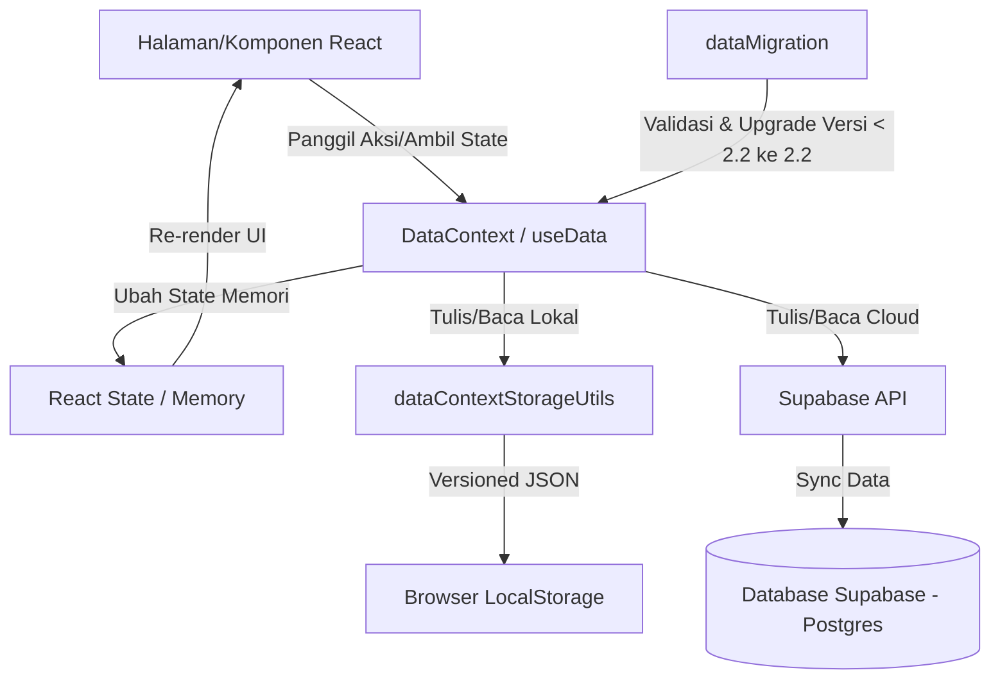

# Dokumentasi Teknis Sistem — Jurnal Saham

Dokumen ini menjelaskan arsitektur internal, aliran data (*data flow*), struktur context provider, serta panduan pengembangan bagi developer yang ingin menambahkan fitur atau modul baru ke dalam sistem `Jurnal Saham`.

---

## 1. Arsitektur Data Flow (Aliran Data)

Sistem Jurnal Saham menggunakan arsitektur **Dual-Engine Persistence** untuk memastikan aplikasi tetap dapat digunakan secara offline (standalone sandbox) maupun online dengan sinkronisasi basis data cloud (Supabase) secara real-time.

### Diagram Aliran Data



### Mekanisme Kerja Aliran Data
1.  **UI Component Action**: Komponen React memanggil fungsi aksi (misalnya `addTrade`, `updateIpoEntry`) yang disediakan oleh `useData()`.
2.  **State Update**: Aksi tersebut langsung memperbarui React state lokal agar perubahan instan terlihat oleh pengguna tanpa jeda jaringan (Optimistic UI).
3.  **Local Persistence**: State yang diperbarui disimpan secara lokal ke `LocalStorage` menggunakan helper dari [dataContextStorageUtils.ts](file:///e:/FullStuck-web-developer/jurnal-saham/src/modules/shared/context/dataContextStorageUtils.ts) yang mendeteksi sesi pengguna saat ini.
4.  **Cloud Synchronization**: Jika koneksi internet aktif dan pengguna masuk menggunakan akun terdaftar, perubahan tersebut secara asinkron disinkronkan ke Supabase DB dengan perlindungan Row Level Security (RLS) berbasis ID Pengguna.
5.  **Audit Trail Logging**: Setiap aksi mutasi data penting memicu fungsi `logUserActivity` untuk mencatat log audit ke sistem lokal/cloud demi kebutuhan keamanan dan analisis aktivitas.

---

## 2. Struktur Context / Provider

Sistem ini didukung oleh tiga context provider utama yang menyelimuti aplikasi di [App.tsx](file:///e:/FullStuck-web-developer/jurnal-saham/src/App.tsx):

### A. AuthContext (`useAuth`)
*   **Fungsi**: Mengelola sesi autentikasi pengguna (login, logout, registrasi, lupa password).
*   **Lokasi**: `src/modules/auth/AuthContext.tsx`
*   **Fitur Keamanan**: Menyediakan objek `user` dan helper izin akses granular seperti pengecekan peran (`role`) pengguna (Admin, Trader, Viewer).

### B. DataContext (`useData`)
*   **Fungsi**: Hub utama pengolahan data transaksi trading, portofolio, dividen, rencana trading, watchlist, personal finance ledger, serta pengaturan aplikasi.
*   **Lokasi**: `src/modules/shared/context/DataContext.tsx`
*   **Sub-Modul Pendukung**:
    *   [dataContextStorageUtils.ts](file:///e:/FullStuck-web-developer/jurnal-saham/src/modules/shared/context/dataContextStorageUtils.ts): Menangani baca/tulis/migrasi ke penyimpanan lokal.
    *   [dataContextIpoDomain.ts](file:///e:/FullStuck-web-developer/jurnal-saham/src/modules/shared/context/dataContextIpoDomain.ts): Mengisolasi logika data Modul IPO (event, entry partisipan, akun IPO) agar file `DataContext.tsx` tidak terlalu padat.
    *   [dataMigration.ts](file:///e:/FullStuck-web-developer/jurnal-saham/src/modules/shared/utils/dataMigration.ts): Memvalidasi skema data serta meng-upgrade struktur ekspor data versi lama ke versi skema terbaru (`2.2`).

### C. DialogContext (`useDialog`)
*   **Fungsi**: Menyediakan layanan modal dialog global seperti dialog konfirmasi (`confirm`), pesan peringatan (`alert`), dan input modal tanpa perlu menduplikasi state modal di setiap halaman.
*   **Lokasi**: `src/modules/shared/context/DialogContext.tsx`

---

## 3. Panduan Penambahan Modul Baru

Untuk menambahkan modul fungsional baru (misalnya modul `Dividen` atau `Analytics` baru), ikuti langkah-langkah terstandarisasi berikut:

### Langkah 1: Buat Folder Modul Baru
Buat struktur folder baru di bawah `src/modules/`:
```text
src/modules/nama-modul/
├── components/          # Komponen UI khusus modul (misal: Card, Form)
├── pages/               # Halaman utama modul yang akan di-routing
├── types/               # Type definitions / TypeScript interfaces
│   └── index.ts
├── utils/               # Fungsi utilitas & kalkulasi logika bisnis khusus
│   └── calculations.ts
└── nama-modul.css       # File style khusus jika diperlukan
```

### Langkah 2: Definisikan Tipe Data (Types)
Tulis tipe data modul Anda secara ketat di `src/modules/nama-modul/types/index.ts`. Pastikan tidak menggunakan tipe data `any`.
```typescript
export interface MyModuleData {
  id: string;
  name: string;
  amount: number;
  date: string;
  createdAt: string;
}
```

### Langkah 3: Daftarkan State & Aksi di DataContext
1. Buka [DataContext.tsx](file:///e:/FullStuck-web-developer/jurnal-saham/src/modules/shared/context/DataContext.tsx).
2. Tambahkan React state baru untuk data modul Anda:
   ```typescript
   const [myModuleData, setMyModuleData] = useState<MyModuleData[]>([]);
   ```
3. Buat fungsi aksi mutasi data (tambah, edit, hapus) lengkap dengan validasi data dan pencatatan audit log:
   ```typescript
   const addMyData = (payload: Omit<MyModuleData, 'id' | 'createdAt'>) => {
     if (!ensureWritable()) return;
     const newData: MyModuleData = {
       ...payload,
       id: crypto.randomUUID(),
       createdAt: new Date().toISOString(),
     };
     const updated = [...myModuleData, newData];
     setMyModuleData(updated);
     persistData('my_module_key', updated);
     logUserActivity('mymodule.added', 'mymodule_item', newData.id, { name: newData.name });
     showToast('Data berhasil ditambahkan');
   };
   ```
4. Ekspos state dan aksi tersebut di dalam nilai kembalian provider (`value` object).

### Langkah 4: Buat Halaman & Tambahkan Routing
1. Buat halaman utama di `src/modules/nama-modul/pages/MyModulePage.tsx` dan konsumsi data via `useData()`:
   ```typescript
   import { useData } from '@/modules/shared/context/DataContext';
   // ...
   const { myModuleData, addMyData } = useData();
   ```
2. Daftarkan rute halaman baru Anda ke dalam file [App.tsx](file:///e:/FullStuck-web-developer/jurnal-saham/src/App.tsx) di bagian rute yang terproteksi (*protected routes*).

---

## 4. Panduan Naming & Typing (Standar Kode)

Untuk menjaga konsistensi kode di seluruh repository Jurnal Saham, ikuti aturan standar berikut:

### Standar Penamaan (Naming Conventions)
*   **Komponen & Halaman React**: Menggunakan **PascalCase** (contoh: `TradesPage.tsx`, `ReconciliationNotice.tsx`).
*   **File Fungsi Bisnis & Utilitas**: Menggunakan **camelCase** (contoh: `calculations.ts`, `dataMigration.ts`).
*   **CSS Stylesheet**: Menggunakan **kebab-case** (contoh: `finance-style.css`).
*   **Nama Fungsi & Variabel**: Menggunakan **camelCase** (contoh: `totalTradingAssets`, `handleDeleteAccount`).
*   **Variabel Konstanta**: Menggunakan **UPPER_SNAKE_CASE** (contoh: `STRATEGIES`, `EMOTIONS`).

### Standar Tipe Data (Typing Rules)
1.  **Dilarang Menggunakan `any`**: Semua parameter fungsi, state, dan properti komponen wajib didefinisikan tipenya secara ketat. Gunakan `unknown` jika tipe data benar-benar dinamis atau buat deklarasi generik `<T>`.
2.  **Gunakan Interface Eksplisit**: Semua data domain inti (seperti `Trade`, `Cashflow`, `IpoEvent`) wajib memiliki interface di [index.ts](file:///e:/FullStuck-web-developer/jurnal-saham/src/modules/shared/types/index.ts).
3.  **Properti Opsional**: Gunakan tanda tanya (`?`) untuk menandakan properti opsional pada interface (contoh: `notes?: string`), bukan union dengan `null` or `undefined` secara manual jika tidak diperlukan.
